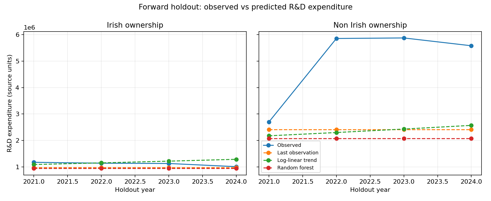

# Ireland Innovation Ecosystem Analytics

An analysis of Irish R&D expenditure, enterprise participation, and intellectual
property activity using Central Statistics Office datasets.

## At a glance

- **Question:** how do ownership structure and time relate to reported business
  R&D expenditure in Ireland?
- **Data:** three CSO extracts covering expenditure, participating enterprises,
  and intellectual-property activity.
- **Methods:** schema harmonisation, missingness analysis, descriptive trends,
  and a leakage-safe forward holdout benchmark.
- **Stack:** Python, pandas, scikit-learn, matplotlib, seaborn.



## The most important technical finding

The three datasets do not form one naturally aligned machine-learning table:
their reporting years and units differ. The historical notebook forced them into
a common grid and then predicted R&D expenditure with features derived from that
same expenditure. That caused target leakage and an implausible R² close to 1.0.

The corrected portfolio analysis makes two deliberate choices:

1. it keeps the datasets separate unless a join is methodologically justified;
2. it models total R&D expenditure using only year and ownership, evaluated on
   later years that were not available to the model during training.

This produces less impressive metrics, but a much more credible technical story.
See [`MODEL_CARD.md`](MODEL_CARD.md) and
[`results/forward_holdout_metrics.csv`](results/forward_holdout_metrics.csv).

On the 2021–2024 forward holdout, the log-linear trend achieved RMSE
`2,056,340` and R² `0.093`, only narrowly ahead of the last-observation baseline
(RMSE `2,060,357`, R² `0.089`). The near-perfect historical result therefore
does not survive leakage-safe temporal validation.

## Reproduce the validated benchmark

```bash
python -m venv .venv
source .venv/bin/activate
pip install -r requirements.txt
python -m src.modeling
pytest -q
```

## Repository map

- [`src/modeling.py`](src/modeling.py): panel construction and forward validation
- [`tests/test_modeling.py`](tests/test_modeling.py): leakage and data-contract tests
- [`results/`](results): validated panel, predictions, metrics, and chart
- [`MODEL_CARD.md`](MODEL_CARD.md): assumptions, intended use, and limitations
- [`Adriana_Soledad_Yash_Ecosystem_of_Innovation_Ireland.ipynb`](Adriana_Soledad_Yash_Ecosystem_of_Innovation_Ireland.ipynb):
  historical academic notebook
- [`CA3_AdrianaSoledadYash_InnovationEcosystem_Report.odt`](CA3_AdrianaSoledadYash_InnovationEcosystem_Report.odt):
  submitted report
- `BSA02`, `BSA22`, and `CIS62` CSV files: source extracts

## Limitations

- The validated panel has two ownership series and only 18 annual observations
  per series.
- Odd years contain actual totals; even years contain official estimates.
- The 2023 increase is a structural challenge for trend-based models.
- The analysis is descriptive and predictive, not causal.

## Author

**Soledad Yash** · Dublin, Ireland<br>
[LinkedIn](https://www.linkedin.com/in/soledad-yash) ·
[GitHub](https://github.com/moonexca)

Academic context and responsible-use notes are available in
[`ACADEMIC_USE_AND_IP.md`](ACADEMIC_USE_AND_IP.md) and
[`AI_USE_DISCLOSURE.md`](AI_USE_DISCLOSURE.md).
